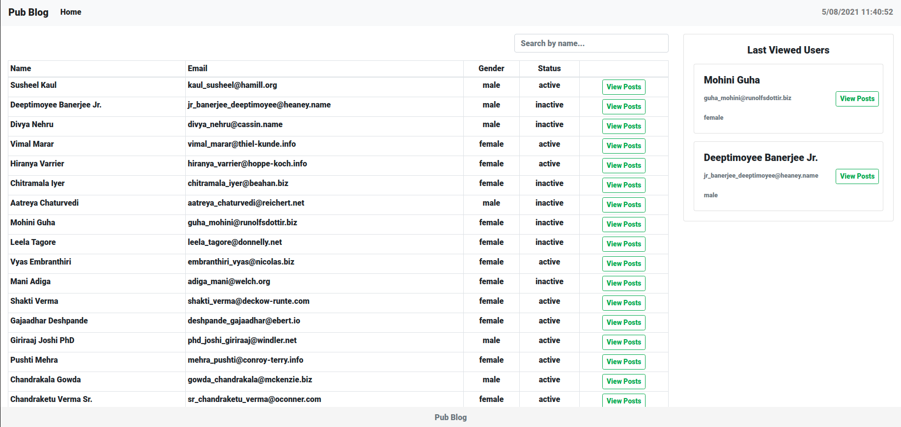

# Pub Blog

## Preview


## Install dependencies
```sh
npm i
```

## To run development server
```sh
ng serve
```

## Todos
* Prepare two pages (as visualized in the attachment)
    * A page which consists a paginated table of Users with a “Name” search filter
in the route : Base url (main route / )
    * A page which shows posts of a specific user in the route :
/posts?userld—(user id)
* Place a digital clock (with a format of 29/09/2020 17:13:15) on a small header on top
of the page, and make it work continuously
* Put the “latest viewed users” component on the right hand side, as a steady
component which will always be visible.

## API Information and Example Requests:

##### Fetching user list: https://gorest.co.in/public-api/users

##### User list with pagination and filtering: https://gorest.co.in/public-api/users?name=varma&page=2

##### Fetching user posts: https://gorest.co.in/public-api/users/:userld/posts
